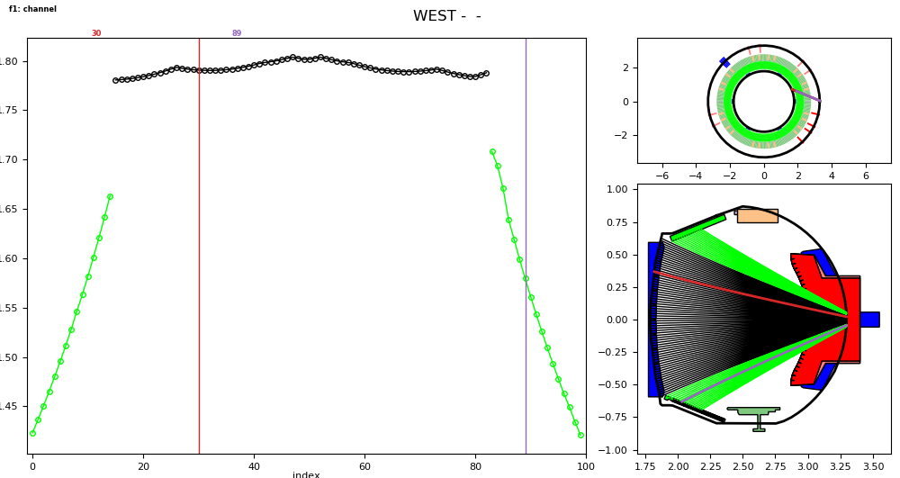
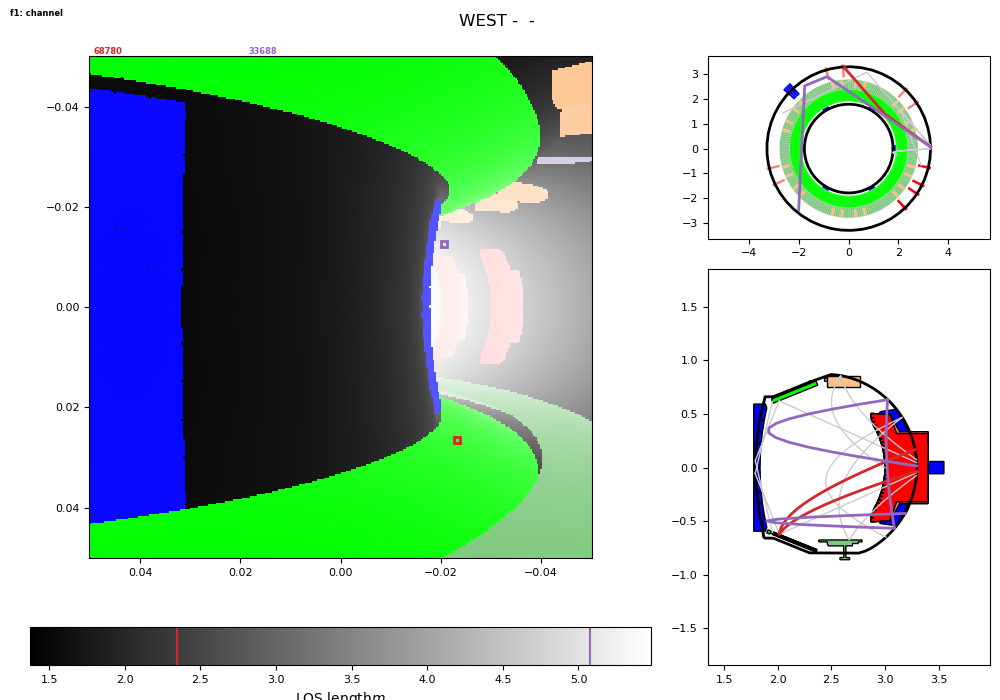
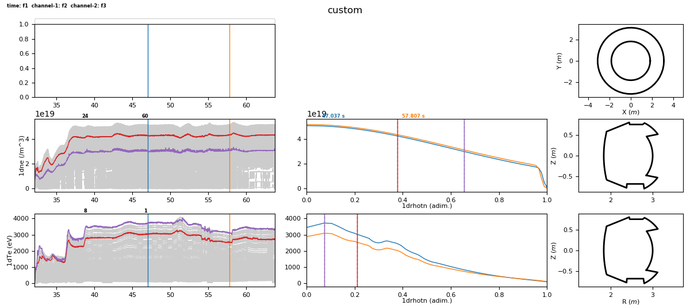

.. image:: https://img.shields.io/travis/ToFuProject/tofu.svg?label=Travis-CI
    :target: https://travis-ci.org/ToFuProject/tofu

.. image:: https://anaconda.org/tofuproject/tofu/badges/version.svg
   :target: https://anaconda.org/tofuproject/tofu/badges/

.. image:: https://anaconda.org/tofuproject/tofu/badges/downloads.svg
      :target: https://anaconda.org/tofuproject/tofu/badges/

.. image:: https://anaconda.org/tofuproject/tofu/badges/latest_release_date.svg
      :target: https://anaconda.org/tofuproject/tofu/badges/

.. image:: https://anaconda.org/tofuproject/tofu/badges/platforms.svg
      :target: https://anaconda.org/tofuproject/tofu/badges/

.. image:: https://anaconda.org/tofuproject/tofu/badges/license.svg
      :target: https://anaconda.org/tofuproject/tofu/badges/

.. image:: https://anaconda.org/tofuproject/tofu/badges/installer/conda.svg
      :target: https://anaconda.org/tofuproject/tofu/badges/

.. image:: https://codecov.io/gh/ToFuProject/tofu/branch/master/graph/badge.svg
      :target: https://codecov.io/gh/ToFuProject/tofu

.. image:: https://badge.fury.io/py/tofu.svg
    :target: https://badge.fury.io/py/tofu

.. _documentation: https://ToFuProject.github.io/tofu/index.html
.. _Github: https://github.com/ToFuProject/tofu

tofu
====

**tofu** stands for **To**\ mography for **Fu**\ sion, it is an IMAS-compatible open-source machine-independent python library
with non-open source plugins containing all machine-dependent routines.

It aims at providing the **fusion** and **plasma** community with an object-oriented, transparent and documented tool for designing **tomography diagnostics**, computing **synthetic signal** (direct problem) as well as **tomographic inversions** (inverse problem). It gives access to a full 3D description of the diagnostic geometry, thus reducing the impact of geometrical approximations on the direct and, most importantly, on the inverse problem.

**tofu** is relevant for all diagnostics integrating, in a finitie field of view or along a set of lines of sight, a quantity (scalar or vector) for which the plasma can be considered transparent (e.g.: light in the visible, UV, soft and hard X-ray ranges, or electron density for interferometers).

**tofu** is **command-line oriented**, for maximum flexibility and scriptability.
The absence of a GUI is compensated by built-in one-liners for interactive plots.

A sphinx-generated documentation_ (to be updated soon), and the code itself is hosted on GitHub_.

Examples Gallery
**********************

Here are some examples of what **tofu** can do

   Built-in one-liners for interactive camera geometry visualization

   ...both for 1D and 2D cameras, including the basics for multiple reflections handling

.. figure:: /README_figures/CamLOS1D_sino.png
   :height: 100px
   :width: 200 px
   :scale: 50 %
   :alt: Built-in plotting of sinograms
   :align: right

   Built-in plotting of sinograms

.. figure:: README_figures/MagfieldLines.png
   :height: 100px
   :width: 200 px
   :scale: 50 %
   :alt: Basic magnetic field line tracing
   :align: right

   Basic magnetic field line tracing

   Multiple 1d profiles interactive plotting

.. figure:: /README_figures/54300_1dTe_svd.png
   :height: 100px
   :width: 200 px
   :scale: 50 %
   :alt: Built-in basic data treatment and interactive plotting: svd and spectrograms
   :align: right

   Built-in basic data treatment and interactive plotting: svd and spectrograms

tofu provides the user with a series of python classes for creating, handling and visualizing a diagnostic geometry, meshes and basis functions, 
geometry matrices, pre-treating experimental data and computing tomographic inversions.

Each one of these main tasks is accomplished by a dedicated module in the larger tofu package.

In its current version, only the geometry and data-handling modules are released. 
The others, while operational, are not user-friendly and documented yet, they will be available in future releases.

The geometry module is sufficient for diagnostic designing and for a synthetic diagnostic approach (i.e.: computing the integrated signal from a simulated 2D or 3D emissivity).
This geometry module allows in particular:

* To handle linear and toroidal vaccum vessels
* To define apertures and detectors as planar polygons of arbitrary shapes, or to define a spherical converging lens and a circular detector in its focal plane.
* To assign an arbitrary number of apertures to each detector (and the apertures do not have to stand in parallel planes)
* To automatically compute the full Volume of Sight (VOS) in 3D of each {detector+aperture(s)} set
* To discretise the VOS for a numerical 3D integration of a simulated emissivity in order to compute the associated signal

It is in this geometrical sense that tofu enables a synthetic diagnostic approach, it does not provide the tools for simulating the emissivity (that should be an input, provided by another code).

IMAS-compatibility
==================

IMAS is a standardized data structure, it comes as an extra layer on the database of any Tokamak to provide a machine-independent way of accessing scientific data.
tofu has built-in advanced classes for handling the interface with IMAS, hold in the imas2tofu sub-package.
It pre-supposes, of course, that IMAS is installed and operational next to your python install, but tofu does not require IMAS to run in general.
If IMAS is not available, tofu will simply display a warning stating that the imas2tofu sub-package is not usable.

tofu can thus easily load and handle multiple IDSs (IMAS data structure units) and provide command-line tools for exporting IMAS data to other general tofu classes (e.g.: Cameras, Plasma2D...) and for interactive plotting.
All tofu objects have methods to facailitate in-python-console introspection, the __repr__ method is overloaded to display relevant information, an dthis is widely used to explore the data loaded from IMAS.

----

Installing tofu
***************

For Windows
------------

* `Follow this link to know how to configure your Windows to code on ToFu ! <doc/Windows_README.rst>`__

For Ubuntu / Mac
-----------------

- **Standard mode**::

    conda install -c tofuproject tofu 

- **Developer mode**

Install dependencies.::

    python (2.7 or 3)
    numpy
    scipy
    matplotlib
    cython >= 0.26
    nose
    pygments
    pandas
    polygon3 (or polygon2 if you are using python 2.7)

Checkout the tofu git repository and from the top directory::
    
    python setup.py build_ext --inplace
    python setup.py install

-----

**Licensing** 

It is distributed under the MIT license and aims at providing the fusion community with 
a transparent and modular tool for creating / designing diagnostics and using them for 
synthetic diagnostic (direct problem) and tomography (inverse problem).

**History**

It was first created at the Max-Planck Institute for Plasma Physics (IPP) in Garching, Germany, 
by Didier Vezinet, and is now maintained / debugged / updated by a team of contributors.

-----

**Warning**
This Pypi package focuses on tomography for fusion research.
It uses the same name as a previous package dedicated to a testing framework coupling fixtures and tests loosely, now renamed **reahl-tofu** and developped by Iwan Vosloo since 2006. If you ended up here looking for a web-oriented library, you should probably redirect to the more recent [**reahl-tofu**](https://pypi.python.org/pypi/reahl-tofu) page.
