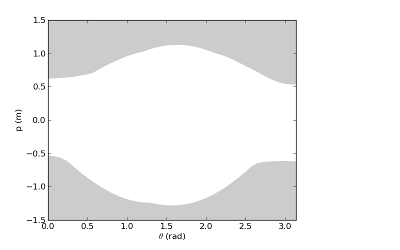
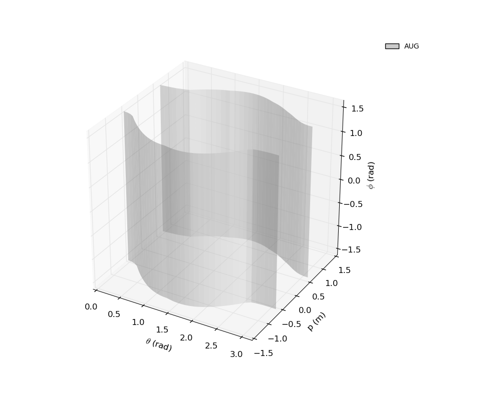
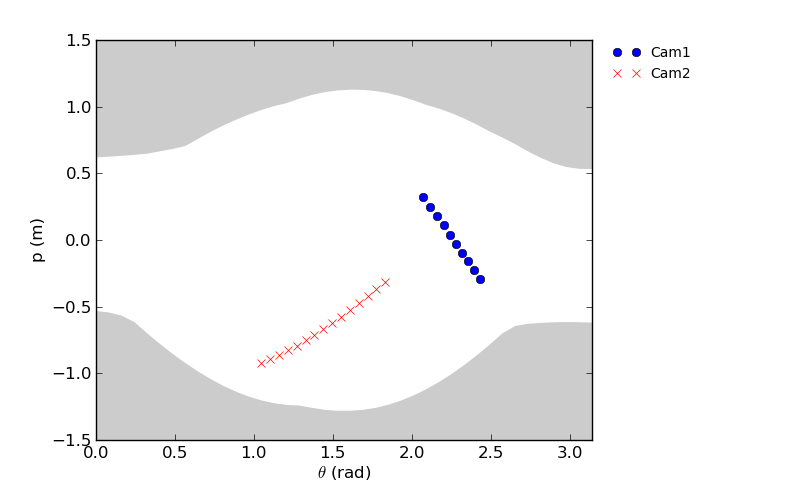
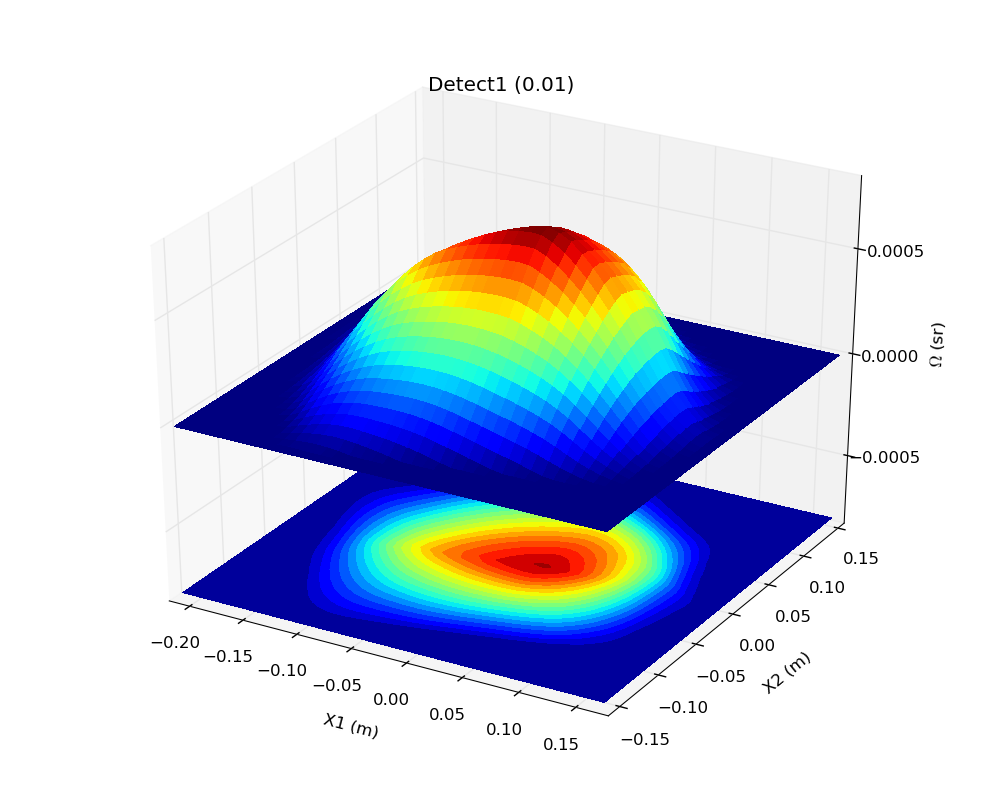
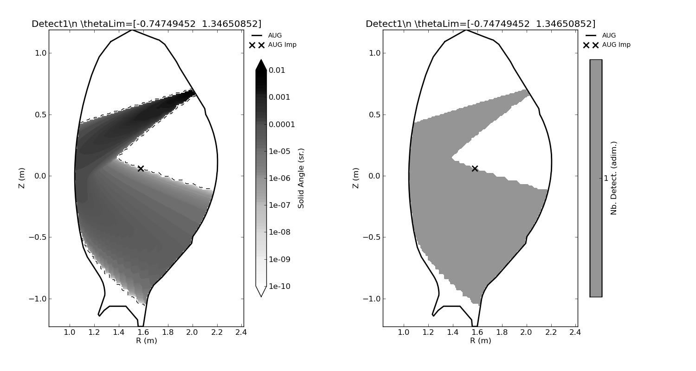
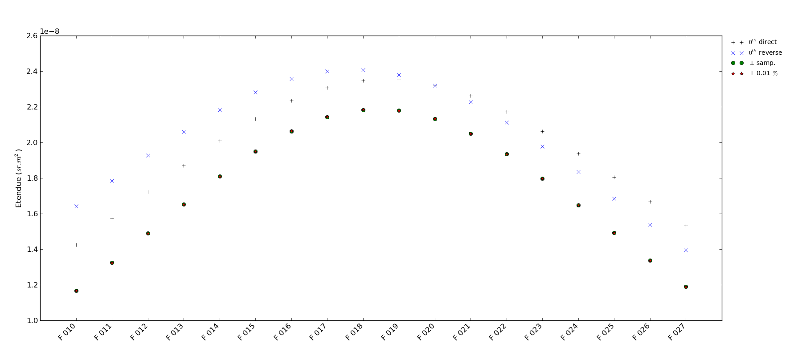
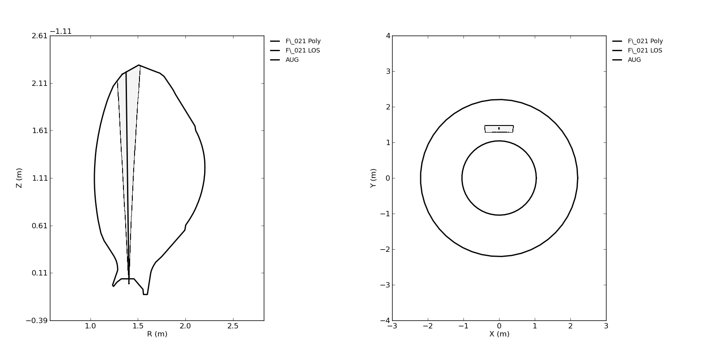
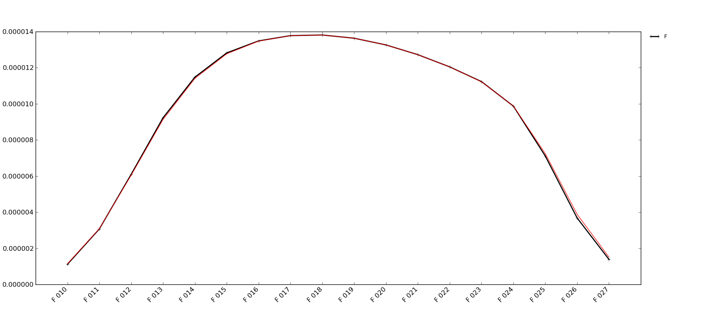

.. role:: envvar(literal)
.. role:: command(literal)
.. role:: file(literal)
.. role:: ref(title-reference)

**ToFu_Geom**
=============

(This project is not finalised yet, work in progress...)

**ToFu_Geom**, is the first ToFu-specific module, it is dedicated to handling the 3D geometry of the diagnostic of interest. It defines 6 objects classes and many functions used as objects methods. It resorts to a module called **General_Geom**, which is not ToFu-specific (i.e.: it mostly conatins functions and has no reference to ToFu objects), which should be entirely re-written using Cython for faster computation. As all the other ToFu-specific modules, **ToFu_Geom** not only defines computing methods but also a variety of plotting methods that can be used to visualise various aspects and characteristics of the diagnostics as well as for debugging.
This section will first give a general presentation of the **ToFu_Geom** module and will then give a tutorial for building your own diagnostic.

**ToFu** is designed for handling passive radiation detectors (e.g.: bolometer foils, semi-conductor diodes or gas detectors), which can be placed behind an arbitrary number of collimating apertures of any shape and orientation. This goes also for the detector, represented by its active surface (the only constraint for apertures and detectors - in the current version - is that each must be represented by a planar polygon, but they do not have to be co-planar). Each detector is thus associated to a list of apertures through which it "sees" a certain volume. The volume of interest is limited, in the case of a Tokamak, to a chamber (i.e.: the vacuum vessel) represented in **ToFu** by a toroid, itself defined by a reference 2D polygon (usually the best possible representation of the inner walls of the Tokamak) which is then expanded toroidally. The volume "seen" by each detector is then the fraction of the toroid that it can "see" directly through its various apertures. On most fusion devices, such passive radiation detectors are located in a poloidal cross-section and arranged so that their cone of vision is very thin, such that it can be represented by a simple line (called a Line Of Sigh, or LOS) and an etendue. **ToFu_Geom** allows for a full 3D description of the whole system, and also for an accurate computation of the geometrically optimal LOS and its associated etendue value. Hence, it is possible to do everything with the two approaches (full 3D or LOS) and quatify the error due to the LOS approximation, if any.

This short introduction gives the key points addressed by **ToFu_Geom**, which can be summarized by listing the 7 object classes and their meaning :

.. list-table:: The object classes in **ToFu_Geom**
   :widths: 10 30 20
   :header-rows: 1

   * - Name
     - Description
     - Inputs needed
   * - ID
     - An identity object that is used by all **ToFu** objects to store specific identity information (name, file name if the object is to be saved, names of other objects necessary for the object creation, date of creation, signal name, signal group, version...)
     - By default only a name (a character string) is necessary, A default file name is constructed (including the object class and date of creation), but every attribute can be modified and extra attribute can be added to suit the specific need of the the data acquisition system of each fusion experiment or the naming conventions of each laboratory.
   * - Tor
     - The limits of the toroidal chamber
     - A 2D polygon in (R,Z) coordinates
   * - LOS
     - A LOS, can be defined by the user for tests, but usually defined by the Detect object as an output
     - A Tor object, a starting point and a unitary vector indicating the direction of observation (the end point is computed), both in 3D (X,Y,Z) coordinates
   * - GLOS
     - A group of LOS objects, with a name (useful for defining cameras which are sets of detectors with a common aperture and a commom name)
     - A list of LOS objects
   * - Aperture
     - An aperture, represented by a planar polygon
     - A Tor object and a planar polygon in 3D (X,Y,Z) coordinates
   * - Detect
     - A detector, represented by its planar active surface, computed a geometrically optimal LOS as an output
     - A Tor object, a planar polygon in 3D (X,Y,Z) coordinates, and a list of Aperture objects
   * - GDetect
     - A group of Detect objects, useful for defining cameras
     - A list of Detect objects

The following will give a more detailed description of each object and its attributes and methods through a tutorial at the end of which you should be able to create your own diagnostics and access its main geometrical characteristics (the will be computed automatically).

Getting started with ToFu_Geom
------------------------------

Once you have downloaded the whole **ToFu** package (and made sur you also have scipy, numpy and matplotlib, as well as a free polygon-handling library called **Polygon** which can be downloaded at http://www.j-raedler.de/projects/polygon/, just start a python interpreter and import **ToFu_Geom** (we will always import **ToFu** modules 'as' a short name to keep track of the functionalities of each module). To handle the local path of your computer, we will also import the small module called **ToFu_PathFile**, and **matplotlib** and **numpy** will also be useful:

.. literalinclude:: ../../src/Tutorial_ToFu_Geom.py
   :language: python
   :lines: 7-12

The os module is used for exploring directories and the cPickle module for saving and loading objects.

The Tor object class
--------------------

To define the volume of the vacuum chamber, you need to know the (R,Z) coordinates of its reference polygon (in a poloidal cross-section). You should provide it as a (2,N) numpy array where N is the number of points defining the polygon. To give the Tor object its own identity you should at least choose a name (i.e.: a character string). For more elaborate identification, you can define an ID object and give as an input instead of a simple name. You can also provide the position of a "center" of the poloidal cross-section (in 2D (R,Z) coordinates as a (2,1) numpy array) that will be used to compute the coordinates in transformation space any LOS using this Tor object (and the sinogram of any scalar emissivity field using this Tor object). If not provided, the center of mass of the reference polygon is used as a default "center".

In the following, we will use the geometry of ASDEX Upgrade as a example. 
We first have to give a reference polygon ('PolyRef' below) as a (2,N) numpy array in (R,Z) coordinates. 

.. literalinclude:: ../../src/Tutorial_ToFu_Geom.py
   :language: python
   :lines: 21-26

Alternatively, you can store PolyRef in a file and save this file locally, or use one of the default tokamak geometry stored on the **ToFu** database where Tor input polygons are stored in 2 lines .txt files (space-separated values of the R coordinates on the first line, and corresponding Z coordinates on the second line). Here, we use the default ASDEX Upgrade reference polygon stored in AUG_Tor.txt.

.. literalinclude:: ../../src/Tutorial_ToFu_Geom.py
   :language: python
   :lines: 29-33

We now have created two Tor objects, and **ToFu_Geom** has computed a series of geometrical characteristics that will be useful later (or that simply provide general information). 
In particular, we have access to the following attributes :

.. list-table:: The attributes of a Tor object
   :widths: 10 40
   :header-rows: 1

   * - Attribute
     - Description
   * - self.ID
     - The ID class of the Tor object
   * - self.Poly
     - The reference polygon used to create the Tor object, as a (2,N) numpy array, where N is the number of points (the last one being identical to the first one)
   * - self.BaryP
     - The barycenter of self.Poly
   * - self.Surf
     - The surface of self.Poly
   * - self.BaryS
     - The center of mass of self.Poly
   * - self.Vect
     - The 2D vectors representing the edges of self.Poly as a (2,N) numpy array
   * - self.Vin
     - The normalised 2D vectors oriented towards the inside of self.Poly for each edge
   * - self.PRMin, self.PRMax
     - The points of self.Poly with the maximum (resp. minimum) R coordinate, as a (2,1) numpy array (one for PRMin, one for PRMax)
   * - self.PZMin, self.PZMax
     - The points of self.Poly with the maximum (resp. minimum) Z coordinate, as a (2,1) numpy array (one for ZPMin, one for PZMax)
   * - self.ImpRZ
     - The (R,Z) coordinates of the point used for computing the impact factor (i.e. the coordinates in projection space(lien)) of the LOS objects using this Tor and of the enveloppe of this Tor (default is self.BaryS)
   * - self.Imp_EnvTheta
     - The discretized values used for computing the enveloppe of Tor in projection space (where theta is in [0,pi], (lien))
   * - self.Imp_EnvMinMax
     - The enveloppe of Tor in projection space (lien) (i.e.: the - algebraic - minimum and maximum impact factor of the reference polygon for each value of self.Imp_EnvTheta)

In addition to these attributes, the Tor object has a number of built-in methods that can be used to visualise its characteristics. As in the whole **ToFu** package, the object methods used for plotting always begin with "self.plot...", where the name of the method after "plot..." is relatively explicit. All the plotting methods are based on matplotlib, and in order to allow for flexibility and customization, you can either pass as input an already existing matplotlib axes on which to plot, or use a predefined default axes (simply by not specifying any axes). Similarly, extensive use of keyword argumants with default values is made, thus all plotting options are customizable since you can pass a dictionnary for element to be plotted (see the detailed documentation of each method to know which kwarg to use for which element).

As an example, you can plot the reference polygon of ASDEX Upgrade in both a poloidal and a toroidal projection, using the default axes (defined in **ToFu_Geom**) :

.. literalinclude:: ../../src/Tutorial_ToFu_Geom.py
   :language: python
   :lines: 36,38

.. figure:: /figures_doc/Fig_Tutor_ToFuGeom_Tor_AllProj.png
   :height: 400px
   :width: 800 px
   :scale: 100 %
   :alt: Poloidal and Toroidal projections of the reference polygon of ASDEX Upgrade
   :align: center

   Poloidal and Toroidal projections of the reference polygon of ASDEX Upgrade

Here we used the keyword argument 'Elt' to specify which elements which wanted to plot. We provided a string in which each letter is a code for an element. Here 'P' stands for the reference polygon and 'I' for the point used for computing the impact parameter of the enveloppe.
We can then re-use the axes of the poloidal projection to plot the vectors defining the edges and the inner side of the reference polygon:

.. literalinclude:: ../../src/Tutorial_ToFu_Geom.py
   :language: python
   :lines: 40,42

(for some mysterious reason it is not working on my Linux station, but it does work on my macbook, as it should)

.. figure:: figures_doc/Fig_Tutor_ToFuGeom_Tor_AllProjAndVect.png
   :height: 400px
   :width: 800 px
   :scale: 100%
   :alt: Poloidal projections of the vectorised reference polygon of ASDEX Upgrade
   :align: center

   Vector representation of the reference polygon of ASDEX Upgrade

We can also plot a 3D representation of the reference polygon, and specify that we only want to plot a fraction of it, between pi/4 and 7pi/4:

.. literalinclude:: ../../src/Tutorial_ToFu_Geom.py
   :language: python
   :lines: 44,46

.. figure:: figures_doc/Fig_Tutor_ToFuGeom_Tor_3D.png
   :height: 400px
   :width: 800 px
   :scale: 100 %
   :alt: 3D fraction of the reference polygon of ASDEX Upgrade
   :align: center

   3D representation of the reference polygon of ASDEX Upgrade

We can also visualise the enveloppe of ASDEX Upgrade in the projection space (lien), in 2D or 3D, with a color of our choosing :

.. literalinclude:: ../../src/Tutorial_ToFu_Geom.py
   :language: python
   :lines: 48,49,52

   Representation in projection space of the reference polygon of ASDEX Upgrade

   Representation in porojection space of the reference polygon of ASDEX Upgrade in 3D, this representation may be usefull when there are LOS which are not contained in a poloidal cross-section, as we will see later

Feel free to explore the various keyword arguments of each method.
This Tor object can then be used as a limit to the volume that can be detected by each LOS or Detect object.

The LOS object class
--------------------

Since most tomography users in the fusion community are familiar with the LOS approximation (which gives satisfactory results in most usual situations), we choose to provide in **ToFu** the two extremes of the spectrum : a pure LOS approximation, and a full 3D approach. Any attempt to compute the geometry matrix with an "advanced" or "improved" LOS approximation (i.e.: taking into account finite beam width, using anti-aliasing techniques with pixels...) can be considered to fall somewhere between these two extremes, and since every user has his own recipes, we do not provide any except the two extreme approaches. Obviously, all users can download **ToFu** and add there own recipe in their local version (this should be done in the **ToFu_MatComp** module). Hence, a pure LOS object exists in **ToFu**, and can be defined with minimum knowledge of the diagnostics : only a point (D) and a unitary vector (u) are necessary for each LOS. The unitary vector shall be pointing towards the direction of observation (i.e.: towards the interior of the vacuum chamber).
nce a LOS id defined, **ToFu** automatically computes a series of points of interest. Indeed, if a Tor object is provided to the LOS object, we can determine the first point of entry into the Tor volume (PIn), and the point were the LOS gets out of it (POut). We can also determine the point on the LOS with minimum R-coordinate (PRMin, which is usually PIn or POut except when the LOS has a strong toroidal inclination, in which case PRMin is somewhere in the middle of the LOS). If the LOS object has a RZImp (by default the RZImp of the associated Tor object), then the impact parameter of the LOS with respect to this RZImp can be computed (has well as its two associated angles), and the LOS can be represented in projection space. 

Hence, a LOS object has the following attributes :

.. list-table:: The attributes of a LOS object
   :widths: 10 40
   :header-rows: 1

   * - Attribute
     - Description
   * - self.ID
     - The ID class of the object
   * - self.D
     - The starting point of the LOS in 3D (X,Y,Z) coordinates (usually the center of mass of the associated detector or the center of mass of the collimating slit for fan-like cameras)
   * - self.u
     - The unitary direction vector in 3D (X,Y,Z) coordinates (oriented towards the interior of the associated Tor)
   * - self.Tor
     - The associated Tor object
   * - self.PIn, self.POut, self.PRMin
     - The particular points, in 3D (X,Y,Z) coordinates, on the LOS associated to the Tor enveloppe : the point at which the LOS enters the volume, the point at which it exits it, and the point of minimum R-coordinate
   * - self.kPIn, self.kPOut, self.kPRMin
     - The length on the LOS (from self.D) of self.PIn, self.POut and self.PRMin
   * - self.RMin
     - The value of the R-coordinate of self.PRMin
   * - self.PolProjAng
     - An estimate of the angle by which the LOS is distorted in its poloidal projection. Value of 0 means the LOS is already in a poloidal cross-section and remains a straight line.
   * - self.PplotOut, self.PplotIn
     - The points along the LOS used to plot its poloidal projection, either the whole LOS (self.PplotOut, from self.D to self.POut) or only the part which is inside the Tor volume (self.PplotIn, from self.PIn to self.POut)
   * - self.ImpRZ
     - The 2D (R,Z) coordinates used to compute the impact factor of the LOS (i.e. its coordinates in projection space), by default self.ImpRZ = self.Tor.ImpRZ
   * - self.ImpP, self.ImpPk, self.ImpPr, self.ImpPTheta
     - The point on the LOS which is closest to the self.ImpRZ (the "impact point") is self.ImpP, and its distance from self.D ((self.ImpP-self.D).(self.u) = self.ImpPk) is self.ImpPk. Its small (geometric) radius from self.ImpRZ is self.ImpPr and its toroidal angle is self.ImpPTheta 
   * - self.Impp, self.Imptheta, self.Impphi
     - The coordinates of the LOS in projection space, where self.Impp is the (positive or negative) impact parameter, self.Imptheta is the projection angle in a poloidal cross-section and self.Impphi is the deviation angle from the poloidal crosss-section (the reference poloidal cross-section being the one which includes self.ImpP).

Defining a LOS object only requires a start point and a unitary vector indicating the viewing direction (both in 3D (X,Y,Z) coordinates), as well as an associated Tor object.
As an example, we can define Los, a LOS object as follows:

.. literalinclude:: ../../src/Tutorial_ToFu_Geom.py
   :language: python
   :lines: 56-60

Note that if you define a LOS objects that does not intersect the Tor volume, you will get an error message telling you that the code could not find a PIn or POut point (both are necessary).
All the geometric characteristics of Los has now been computed (the coordinates in projection space have been computed using the center of mass of the reference polygon of Tor2 as default, but they can be re-computed with another reference point, as we will see later). The built-in routines can be used to visualise Los, and we specify, thanks to the keyword argument 'PDIOR' that we not only want to see the LOS itself but also the position of the particular points that were computed or that were used for its definition (self.D, self.PIn, self.POut and self.PRMin => DIOR). In order to better visualise it, we plot it both in poloidal and toroidal projections, re-using a set of axes on which we first plot Tor2:

.. literalinclude:: ../../src/Tutorial_ToFu_Geom.py
   :language: python
   :lines: 62-63,65

.. figure:: figures_doc/Fig_Tutor_ToFuGeom_LOS_AllProj.png
   :height: 400px
   :width: 800 px
   :scale: 100 %
   :alt: Poloidal and toroidal projection of a user-defined LOS object, with points of interest and parent Tor object
   :align: center

   Poloidal and toroidal projection of a user-defined LOS object, with points of interest and parent Tor object

We used again here the 'Elt' keyword argument to specify that we want to plot the LOS itself ('L'), the particular points self.D ('D'), self.PIn ('I'), self.POut('O'), self.PRMin ('R') and self.ImpP ('r').
In fact, since the LOS object has a Tor attribute, the possibly of plotting the Tor object at the same time as the LOS object is provided in the same method, through the kwdarg 'EltTor' (just provide the same letters as for a Tor object).

Like for the Tor object, the LOS object can also be plotted in 3D using the plot_3D_plt() method:

.. literalinclude:: ../../src/Tutorial_ToFu_Geom.py
   :language: python
   :lines: 67,69

.. figure:: figures_doc/Fig_Tutor_ToFuGeom_LOS_3D.png
   :height: 400px
   :width: 800 px
   :scale: 100 %
   :alt: 3D plot of a user-defined LOS object, with points of interest and parent Tor object
   :align: center

   3D plot of a user-defined LOS object, with points of interest and parent Tor object

Where we have plotted the associated Tor object using the kwdarg 'EltTor' and changed the dictionaries for the self.PRMin and self.ImpP points.
But generally matplotlib is not the best library for 3D plots with several objects, hence, mayavi is currently being considered for implementation since it is much more adapted to this particular task.

Also, the coordinates of Los in projection space can be plotted on the same graph as the enveloppe of Tor2 was plotted, in 2D or 3D (3D being relevant to take into account the fact that Los does not lie in a poloidal cross section). Beware that these coordinates depend on the reference point chosen. To illustrate this, we compute the impact parameter of Los with the default reference point (i.e.: the center of mass of its associated Tor object) in blue and with a different, arbitrary, reference point in red:

.. literalinclude:: ../../src/Tutorial_ToFu_Geom.py
   :language: python
   :lines: 71-76,78

.. figure:: figures_doc/Fig_Tutor_ToFuGeom_LOS_ImpPol.png
   :height: 400px
   :width: 800 px
   :scale: 80 %
   :alt: Coordinates in projection space of Los, with respect to two different reference points
   :align: center
   
   Coordinates in projection space of Los, with respect to two different reference points

N.B.: In fact the enveloppe of Tor2 changes also when we change the reference point, but only the first enveloppe is displayed here for clarity.
Now we know how to build a LOS object, get its main geometrical characteristics and plot it. But most tomography diagnotics rely on tens or hundreds of different LOS which, in the fusion community, are usually grouped in what is called "cameras". A "camera" is typically a set of several detectors which share a common aperture in a fan-like arrangement, which is a good compromise between room saving (access is scarce around Tokamaks) and good geometrical coverage. Hence, a LOS can be defined for each detector as the line that runs through its center of mass and through the center of mass of its associated aperture. The fan-like arrangement means that all LOS belonging to the same camera will cross at their common aprture. To this purely goemterical consideration, one must add the data acquisition system which often treats data from a camera as a group of signals identified by a common nomenclature. 
For these reasons, it is useful to define an object embodying the notion of "camera", which is simply done by the GLOS object class. 

ToDo : add visualisation options for for the reference points and LOS.ImpP in physical space (add kwdarg in existing functions)

The GLOS object class
---------------------

The GLOS object class (where GLOS stands for Group of Lines Of Sight) is simply a list of LOS objects with a common ID class (i.e.: a common name and other identity features). It is useful for fast and easy handling of a large number of LOS. 

.. list-table:: The attributes of a GLOS object
   :widths: 10 40
   :header-rows: 1

   * - Attribute
     - Description
   * - self.ID
     - The ID class of the object
   * - self.LLOS, self.nLOS
     - The list of LOS objects contained in this group, and the number of LOS (self.nLOS = len(self.LLOS))
   * - self.Tor
     - The Tor object common to all LOS of self.LLOS

The methods of a GLOS object can be seperated in two categories. First, all the LOS objects methods are reproduced in such a way as to handle all the LOS contained in GLOS (for example with "for" loops). These include in particular the plotting methods. Second, some methods are provided to facilitate selection of sub-sets of LOS in the GLOS objects and handle them.
For example, we can create two cameras of respectively 10 amd 15 LOS:

.. literalinclude:: ../../src/Tutorial_ToFu_Geom.py
   :language: python
   :lines: 81-90

We can then plot their poloidal and toroidal projections (without the particular points) , on top of the reference polygon of Tor2:

.. literalinclude:: ../../src/Tutorial_ToFu_Geom.py
   :language: python
   :lines: 93-94,96

.. figure:: figures_doc/Fig_Tutor_ToFuGeom_GLOS_AllProj.png
   :height: 400px
   :width: 800 px
   :scale: 100 %
   :alt: Poloidal and toroidal projections of two arbitrary cameras, with differenmt plotting options
   :align: center
   
   Poloidal and toroidal projections of two arbitrary cameras, with differenmt plotting options

Notice here that we used the keyword argument "LPlot" to specify that the LOS of the first camera should only be plotted inside the Tor volume (i.e.: from PIn to POut) whereas tyhe default is to plot the entire LOS (Lplot='Tot', which plots the LOS from D to POut). We also used the "Ldict" kwdarg to specify a dictionnary for the plotting command.

Like the LOS objects, a GLOS object enables you to plot the coordinates in projection space of all the LOS it contains (in 2D or 3D):

.. literalinclude:: ../../src/Tutorial_ToFu_Geom.py
   :language: python
   :lines: 99-101,103

   
   Coordinates in projection space of the two cameras, with the Tor enveloppe

In adition to these methods which echo the methods of the LOS class, the GLOS class offers tools to select subsets of the list of LOS from which it was created.
This is were the relevance of the ID class starts to show, indeed, besides the Name that you gave to your objects, you might want to store data which is both specific to these objects and to your needs or to the naming conventions of your laboratory. For example, you might want to know enter the signal code associated to each detector, or the age of each detector (to have an idea of the effect of ageing on its performance)... Hence, when you create an object - like a LOS for example - you can add extra attributes to its ID class. These attributes are anything that you consider helpful to identify / discriminate a particular object. In the following example, we re-create a camera, but we add the code signal ("Signal" + number of LOS) and age (between 0 and 3 years) of each detector to the ID class of its LOS:

.. literalinclude:: ../../src/Tutorial_ToFu_Geom.py
   :language: python
   :lines: 106-108

We can now ask the GLOS object to give us a list of its LOS that match a criteria of our choosing.
There are two methods to do this. They take the same arguments, but the first one will return a numpy array of boolean indices (for later use if you need it), while the second one directly returns a list of LOS objects (and uses the first one). For example, we use the first one to get the indices of LOS with a signal code equal to "Signal0" or "Signal50", and the second one to get a list of LOS aged less than a year:

.. literalinclude:: ../../src/Tutorial_ToFu_Geom.py
   :language: python
   :lines: 109-111

The flexibility is provided through the use of eval() which allows for string expressions. 
These methods are intended to provide the necessary flexibility for quick adaptation to your specific needs. Depending on return on experience, it may also evolve or be developped further.
Alternatively, you can also build a list of the attributes you are interest in and then use the list() methods to get the indices you want:

.. literalinclude:: ../../src/Tutorial_ToFu_Geom.py
   :language: python
   :lines: 113-115

As was already said, **ToFu** provides you with the possibility of defining and using LOS if you wish, however, its main features reside in the 3D description of the diagnostic, of which the LOS description is just an approximation (which can be sufficient for your needs, depending on the geometry of your system, on the physics at play and on the accuracy that you want to acheive).
In the following, we introduce the Detect class which is used to handle the 3D geometry of the problem. Once a Detect object is created, it can be associated to several Aperture objects to determine its 3D field of view. Consequently, the geometrically optimal LOS can also be computed and the associated LOS object can be easily produced on demand, we then generally advise to directly create Detect objects, of which LOS objects can be seen as a subproduct.

The Detect and Apert object classes
-----------------------------------

In addition to what as been said above, creating dierctly a Detect object instead of a LOS object will provide you with the ability to compute an accurate value of the etendue associated to the LOS approximation (link to definition of etendue and why it is important for proper use of LOS approximation). 
In its current version, **ToFu** handles apertures as 3D planar polygons which, to this day, have the following attributes:

.. list-table:: The attributes of an Apert object
   :widths: 10 40
   :header-rows: 1

   * - Attribute
     - Description
   * - self.ID
     - The ID class of the object
   * - self.Poly, self.PolyN
     - A (3,N) numpy array representing a planar polygon in 3D (X,Y,Z) coordinates, and the number of points that this polygon is comprised of.
   * - self.BaryP, self.BaryS, self.S, self.nIn
     - The barycenter of self.Poly and its center of mass, its surface and the normalised vector perpendicular to the plane of self.Poly and oriented towards the interior of the Tor volume.
   * - self.Tor
     - The Tor object associated to the Detect object

The Apert object is mainly used as a computing intermediate for the Detect object. However, it does come along with some key plotting methods aimed at giving you an idea of its geometry in the usual projections (poloidal and toroidal) and in 3D.

Similarily, **ToFu** handles apertures as 3D planar polygons (i.e.: the polygon embodying the active surface of the detector) which, to this day, have the following attributes:

.. list-table:: The attributes of a Detect object
   :widths: 10 40
   :header-rows: 1

   * - Attribute
     - Description
   * - self.ID
     - The ID class of the object
   * - self.Poly, self.PolyN
     - A (3,N) numpy array representing a planar polygon in 3D (X,Y,Z) coordinates, and the number of points that this polygon is comprised of.
   * - self.BaryP, self.BaryS, self.S, self.nIn
     - The barycenter of self.Poly and its center of mass, its surface and the normalised vector perpendicular to the plane of self.Poly and oriented towards the interior of the Tor volume
   * - self.Tor
     - The Tor object associated to the Detect object
   * - self.LApert
     - A list of Apert objects associated to the Detect object
   * - self.LOS
     - A LOS object corresponding to the geometrically optimal LOS going through self.BaryS and through the center of mass of the intersection of all the associated Apert objects. Its value is 'Impossible' if the geometry you built does not allow for the existence of a LOS (i.e.: if the volume inside Tor viewed by the detector through its apertures is zero).
   * - self.LOS_TorAngRef
     - The value of toroidal angle corresponding to the position of the middle of the LOS (between self.LOS.PIn and self.LOS.POut), used by plotting methods, can be different from the toroidal angle of the detector if the LOS does not stand in a poloidal cross-section.
   * - self.LOS_Etend_0Approx, self.LOS_Etend_0ApproxRev, self.LOS_Etend_PerpSamp, self.LOS_Etend_Perp, self.LOS_Etend_RelErr
     - Values of the etendue, computed respectively using a fast 0th order approximation, a 0th order approximation reversed, a sampled integral in a plane perpendicular to the LOS, an adaptative integral in a plane perpendicular to the LOS. The last attribute is the relative error tolerance used for the adaptative computation of the integral (default is 0.01 %).
   * - self.Span_R, self.Span_Theta, self.Span_Z, self.Span_k
     - The tuples indicating the min and max values of the cylindrical (R,Theta,Z) coordinates inside which the viewing cone of the Detect object can be found. These are limits that define a box inside which the viewing cone is found, they do not give the viewing come itself. The Span_k attribute corresponds to the span of the component along self.LOS.u that can be reached inside the viewing cone (estimated by sampling the viewing cone into more than 1000 LOS - the exact number depends on self.Poly and on the shapes of the apertures and can be tuned by parameters).
   * - self.Span_NEdge, self.Span_NRad
     - The parameters that were used for computing the span in cylindrical coordinates of the system. The first one quantifies the number of extra points added on the polygon edges, and the second one the number of extra points added in the radial direction.
   * - self.Cone_PolyPol, self.Cone_PolyTor
     - The poloidal and toroidal projectiosn of the 3D viewing cone of the {detector+apertures} system. These projected polygons are useful for visualising the detected volume (or rather its projections) and for fast discrimination of points which are inside / outside of this detected volume (i.e.: fast computation of integrated signal)
   
Now we are going to create two arbitrary Apert objects and one Detect object to show how it is done and what information it gives access to.
As already mentioned, the various Apert objects associated to a Detect object must be planar polygons, but they do not need to be coplanar, and they can have any arbitrary shape, hence:

.. literalinclude:: ../../src/Tutorial_ToFu_Geom.py
   :language: python
   :lines: 118-136

Note that the computation may take some time (several seconds) due to the accurate computation of the etendue. If you do not need the etendue, you can avoid its computation using the kwdarg 'CalcEtend'=False (default value is True).
Once we can check that the constructed geometry is relevant (i.e.: that it allows for a non-zero detected volume, which means that a LOS should exist), we can plot the associated Detect elements and LOS:

.. literalinclude:: ../../src/Tutorial_ToFu_Geom.py
   :language: python
   :lines: 139,143

.. figure:: figures_doc/Fig_Tutor_ToFuGeom_Detect_AllProj.png
   :height: 400px
   :width: 800 px
   :scale: 100 %
   :alt: Poloidal and toroidal projections of a Detect object with all its associated objects (2 Apert objects, a Tor object, and a subsequent LOS object)
   :align: center
   
   Poloidal and toroidal projections of a Detect object with all its associated objects (2 Apert objects, a Tor object, and a subsequent LOS object)

As said earlier, the three polygons do not have to be coplanar, as is visible on the next figure on which we only plotted the two Apert objects and the Detect object (with their perpendicular vectors), as well as the start point of the LOS and its entry point into the Tor volume (in blue):

.. literalinclude:: ../../src/Tutorial_ToFu_Geom.py
   :language: python
   :lines: 140,143

.. figure:: figures_doc/Fig_Tutor_ToFuGeom_Detect_3D.png
   :height: 400px
   :width: 800 px
   :scale: 100 %
   :alt: 3D plot of an arbitrary Detect object with two non-coplanar Apert objects
   :align: center
   
   3D plot of an arbitrary Detect object with two non-coplanar Apert objects

Since the Detect object has a LOS object as an attribute, all the LOS methods are accessible via this LOS attribute, making it easy to plot the coordinates in projection space of the LOS of this particular Detect object.

We saw that the etendue is computed automatically when the Detect object is defined. This is done via numerical integration, on a plane perpendicular to the goemetrically optimal LOS, of the solid angle subtended by the Detect and its Apert objects. **ToFu_Geom** thus has built-in routines to compute that solid angle from any point in the 3D Tor volume. This will also be useful to compute the total signal received by the detector from a given radiation field.
Of course, when taken on a plane perpendicular to the geometrically optimal LOS, the solid angle decreases as we get to the edge of the viewing cone. You can visualise the solid angle on any plane perpendicular to the LOS simply by choosing its relative position on the LOS via the 'Ra' kwdarg of the following method (0 and 1 corresponding respectively to the PIn and POut points of the LOS):

.. literalinclude:: ../../src/Tutorial_ToFu_Geom.py
   :language: python
   :lines: 145,147

   
   Surface plot of the solid angle subtended by the {Detector + Apertures} system as seen from points on a plane perpendicular to the system's LOS and placed at mid-length of the LOS

The value in parenthesis in the title is a ratio (here 1 %) used to plot make sure the plot includes the entirety of the viewing cone in this plane (i.e.: the plotting surface is 1 % larger than the estimated support of the viewing cone). The reason why this surface has no easily reckognisable shape is due to the fact that it comes from a system consisting of 3 non-coplanar polygons with various shapes. If we had used a square detector with a coplanar square aperture, the square shape would have been visible on the iso-contours of the solid angle. 

Similarily, it is possible to simply plot the evolution of the etendue (solid angle integrated on the plane) as a function of the point's distance on the LOS (to check that it remains constant), using three different integration methods (two via discretisation and one via an adaptative algorithm), this may take a while because the etendue has to computed Nx3 times (3 times for each point):

.. literalinclude:: ../../src/Tutorial_ToFu_Geom.py
   :language: python
   :lines: 150,152

.. figure:: figures_doc/Fig_Tutor_ToFuGeom_Detect_EtendAlongLOS.png
   :height: 400px
   :width: 800 px
   :scale: 100 %
   :alt: Etendue of the {Detector + Apertures} system as a function of the relative distance along the LOS (from 0 = self.LOS.PIn to 1 = self.LOS.POut), with three different integration methods using their defaults settings
   :align: center
   
   Etendue of the {Detector + Apertures} system as a function of the relative distance along the LOS (from 0 = self.LOS.PIn to 1 = self.LOS.POut), with three different integration methods using their defaults settings

We can see that the default settings used for each method are sufficient to give an accurate computation of the etendue that remains constant along the LOS, as it should.

Now, in order to explore further the geometry of the system, we can plot the value of the solid angle in any poloidal plane (respectively horizonntal plane) intersecting the viewing cone, we can then visualise the viewing cone:

.. literalinclude:: ../../src/Tutorial_ToFu_Geom.py
   :language: python
   :lines: 155-158,161

.. figure:: figures_doc/Fig_Tutor_ToFuGeom_Detect_SAngPolSlice.png
   :height: 400px
   :width: 800 px
   :scale: 100 %
   :alt: (Left) Contour plot of the solid angle subtended by the {Detector+Apertures} system (Right) Number of detectors that can "see" each point of the same poloidal slice (this will be useful for systems with several detectors)
   :align: center
   
   (Left) Contour plot of the solid angle subtended by the {Detector+Apertures} system (Right) Number of detectors that can "see" each point of the same poloidal slice (this will be useful for systems with several detectors)

.. figure:: figures_doc/Fig_Tutor_ToFuGeom_Detect_SAngTorSlice.png
   :height: 400px
   :width: 800 px
   :scale: 100 %
   :alt: (Left) Contour plot of the solid angle subtended by the {Detector+Apertures} system (Right) Number of detectors that can "see" each point of the same horizontal slice (this will be useful for systems with several detectors)
   :align: center
   
   (Left) Contour plot of the solid angle subtended by the {Detector+Apertures} system (Right) Number of detectors that can "see" each point of the same horizontal slice (this will be useful for systems with several detectors)

By default the poloidal slice is the plane which interssects the LOS at mid-length, by you can choose any toroidal angle by using the "Theta" kwdarg. 
Note that the above plots are poloidal (resp. horizontal) *slices*, not *projections*. In its current version, **ToFu_Geom** only allows to plot *projections* by computing the solid angle for several discrete *slices* (25 by default, plus particular slices including self.LOS.PIn, self.LOS.POut and the mid-length point) close to each other and plotting the maximum value for each points (computation is very long in the current, non-optimised, python-only version, typically 20-30 min for 10 slices):

.. literalinclude:: ../../src/Tutorial_ToFu_Geom.py
   :language: python
   :lines: 164-167,170

   
   (Left) Contour plot of the solid angle subtended by the {Detector+Apertures} system in a poloidal projection (Right) Number of detectors that can "see" each point (this will be useful for systems with several detectors)

.. figure:: figures_doc/Fig_Tutor_ToFuGeom_Detect_SAngTorProj.png
   :height: 400px
   :width: 800 px
   :scale: 100 %
   :alt: (Left) Contour plot of the solid angle subtended by the {Detector+Apertures} system in a horizontal - or toroidal - projection (Right) Number of detectors that can "see" each point (this will be useful for systems with several detectors)
   :align: center
   
   (Left) Contour plot of the solid angle subtended by the {Detector+Apertures} system in a horizontal - or toroidal - projection  (Right) Number of detectors that can "see" each point (this will be useful for systems with several detectors)

Notice that there is a collision-detection routine in the ray tracing code that takes into account the fact that the viewing cone is limited by the Tor instance. This caveat can be de-activated by using the "Colis" kwdarg (=True by default), as illustrated in the following:

.. literalinclude:: ../../src/Tutorial_ToFu_Geom.py
   :language: python
   :lines: 173-176,179

.. figure:: figures_doc/Fig_Tutor_ToFuGeom_Detect_SAngPolProj_NoColis.png
   :height: 400px
   :width: 800 px
   :scale: 100 %
   :alt: (Left) Contour plot of the solid angle subtended by the {Detector+Apertures} system in a poloidal projection with de-activated collision detection (Right) Number of detectors that can "see" each point (this will be useful for systems with several detectors)
   :align: center
   
   (Left) Contour plot of the solid angle subtended by the {Detector+Apertures} system in a poloidal projection with de-activated collision detection (Right) Number of detectors that can "see" each point (this will be useful for systems with several detectors)

.. figure:: figures_doc/Fig_Tutor_ToFuGeom_Detect_SAngTorProj_NoColis.png
   :height: 400px
   :width: 800 px
   :scale: 100 %
   :alt: (Left) Contour plot of the solid angle subtended by the {Detector+Apertures} system in a horizontal - or toroidal - projection with de-activated collision detection (Right) Number of detectors that can "see" each point (this will be useful for systems with several detectors)
   :align: center
   
   (Left) Contour plot of the solid angle subtended by the {Detector+Apertures} system in a horizontal - or toroidal - projection with de-activated collision detection (Right) Number of detectors that can "see" each point (this will be useful for systems with several detectors)

These plotting commands give a pretty good idea of the fraction of the Tor volume which is seen by the detector through its associated apertures.
It is actually these functionalities (plotting poloidal and toroidal projections of the solid angle) that are used to extract the poloidal and toroidal projections of the viewing cone as two sets of 2D polygons (i.e.: the 0 iso-contours of the solid angle projections). These two projected polygons can be simply plotted by adding 'C' (like 'cone') to the "Elt" kwdarg of the plot_PolProj and plot_TorProj plotting methods:

.. literalinclude:: ../../src/Tutorial_ToFu_Geom.py
   :language: python
   :lines: 182,184

.. figure:: figures_doc/Fig_Tutor_ToFuGeom_Detect_AllProj_Cone.png
   :height: 400px
   :width: 800 px
   :scale: 100 %
   :alt: Poloidal and toroidal projections of Detect elements, this time including the projected polygons of the viewing cone
   :align: center
   
   Poloidal and toroidal projections of Detect elements, this time including the projected polygons of the viewing cone

If you want to use the LOS approximation, you have to make sure it is valid. This approximation relies on several assumptions, one of which is that the etendue must remain constant along the LOS. We confirmed this in our case when we plotted it. However, we did not take into account the fact that a fraction only of the viewing stops where the LOS stops, and that the other fraction continues its way into the vacuum chamber. This means that there will be contributons to the signal which are not taken into account by the current LOS. An option could be to artificially extend the LOS through the central solenoid to the far end of the viewing cone, but this would still be unsufficient since the etendue that should be used for this extended part of the LOS is lower than the one we computed for the first part of the LOS.
This type of situations, in which a fraction of the viewing cone is obstructed, corresponds to situations in which the etendue is in fact not constant along the entirety of the *extended* LOS (i.e.: extended to the far end of the viewing cone), as illustrated below. It reveals the limits to the LOS approximation and the advantages of a 3D description of the geometry.

.. literalinclude:: ../../src/Tutorial_ToFu_Geom.py
   :language: python
   :lines: 187-189,191

.. figure:: figures_doc/Fig_Tutor_ToFuGeom_Detect_EtendAlongLOS_Extend.png
   :height: 500px
   :width: 700 px
   :scale: 100 %
   :alt: Etendue of the {Detector + Apertures} system as a function of the relative distance along the *extended* LOS, with and without taking into account collisions, and along the former LOS.
   :align: center
   
   Etendue of the {Detector + Apertures} system as a function of the relative distance along the *extended* LOS, with and without taking into account collisions, and along the former LOS.

In addition to this effect, it also possible to visualise the difference between the LOS approximation and the real viewing cone by plotting the contour of the viewed volume in projection space, as illustrated below:

.. literalinclude:: ../../src/Tutorial_ToFu_Geom.py
   :language: python
   :lines: 195,197

.. figure:: figures_doc/Fig_Tutor_ToFuGeom_Detect_Imp.png
   :height: 500px
   :width: 700 px
   :scale: 100 %
   :alt: Etendue of the {Detector + Apertures} system as a function of the relative distance along the *extended* LOS, with and without taking into account collisions, and along the former LOS.
   :align: center
   
   Etendue of the {Detector + Apertures} system as a function of the relative distance along the *extended* LOS, with and without taking into account collisions, and along the former LOS.

The more the area delimited by the contour is small, the better is the LOS approximation. We can clearly see here that the difference is significant. But it could nevertheless still be valid if the tomogram of the observed emissivity field was constant on this area (which is not the case in most standard situations).

More that visualisation or computation of the etendue, knowing the two projected polygons of the viewing cone is helpful for faster integration of signal in a synthetic diagnostic approach. Indeed, we know that all points which are not in both projected polygons are necessarily outside of the viewing cone. Hence, they can be used for fast discrimination of points which are useless for the signal.

Hence, the total incoming power on the detector for a given spectrally-integrated 3D emissivity field (provided as an input function of the position as a (3,1) numpy array) can be computed. As for the computation of the etendue, you can choose between three integration methods (via the "Mode" kwdarg), among which two discretisation methods and an adaptative algorithm (computation may be very long for high resolution discretisation with Colis=True). The following example shows a simple gaussian profile, constant on the toroidal direction:

.. literalinclude:: ../../src/Tutorial_ToFu_Geom.py
   :language: python
   :lines: 201-214,216-219

.. literalinclude:: ../../src/Tutorial_ToFu_Geom.py
   :language: python
   :lines: 220

.. figure:: figures_doc/Fig_Tutor_ToFuGeom_Detect_SynthDiag.png
   :height: 500px
   :width: 400 px
   :scale: 100 %
   :alt: Fake (double gaussian) SXR emissivity field (toroidally invariant) which resembles one of the typical cases of ASDEX Upgrade
   :align: center
   
   Fake (double gaussian) SXR emissivity field (toroidally invariant) which resembles one of the typical cases of ASDEX Upgrade

As one can expect, the signal is higher when collisions with the Tor boundary are not considered because of the contribution from the plasma volume which should be hidden behind the central solenoid.

This direct approach is most accurate (provided sufficient discretisation of the integral) since it does not rely on a generic pre-defined spatial discretisation of the 3D emissivity on a mesh. 
Such discretisation is nonetheless necessary for tomographic inversions and allows for much faster synthetic diagnostic computation since the input emissivity function can be projected on so-called 'basis functions' with pre-computed contributions (via the so-called geometry matrix) to each detector. Spatial discretisation is addressed in the **ToFu_Mesh** module and the computation of the geometry matrix (both with a 3D and a LOS approach) is addressed in the **ToFu_MatComp** module.

But before, let us describe the last object class of **ToFu_Geom**, which is the Detect equivalent of the GLOS object class.

The GDetect object class
------------------------

The GDetect object class provides an easy way to handle groups of detectors which have some features in common, like the GLOS object class does for LOS objects. It is basically a list of Detect objects with a common name and adapted methods for easily computing and plotting the characteristics of all detectors it contains with a single-line command. It also comes with selection methods to extract a sub-set of its Detect objects.

.. list-table:: The attributes of a GDetect object
   :widths: 10 40
   :header-rows: 1

   * - Attribute
     - Description
   * - self.ID
     - The ID class of the object
   * - self.LDetect, self.nDetect
     - A list of Detect objects, which should have the same Tor object, and the number of Detect object it contains
   * - self.BaryP, self.BaryS, self.S, self.nIn
     - The barycenter of self.Poly and its center of mass, its surface and the normalised vector perpendicular to the plane of self.Poly and oriented towards the interior of the Tor volume
   * - self.Tor
     - The Tor object associated to the Detect object
   * - self.LApert
     - A list of Apert objects associated to the Detect object

Naturally, the methods are similar to both the GLOS object and Detect object class.
In the following, the GDetect object class is illustrated with the geometry of the F camera of the SXR diagnostic of ASDEX Upgrade. 
Once it is loaded as a **ToFu_Geom** GDetect instance, we can use the built-in methods to explore its characterisrics, like the etendue of each detector it is comprised of:

.. literalinclude:: ../../src/Tutorial_ToFu_Geom.py
   :language: python
   :lines: 237-242,244

   
   Etendues of the detectors composing the F camera of ASDEX Upgrade, computed using the usual 0-order approximation in both ways (direct and reverse), and using a complete integration with an adaptative algorithm (with reltive error < 0.01 %) and a sampling algorithm.

We can also visualise the lines of sight and projected viewing cones of all the detectors. In the following example, we use the 'Elt'-type kwdrg to specify that we first want to plot the viewing cone and the polygon constituting the detectors ('CP'), with the polygons of the apertures ('P') and the reference polygon of the Tor ('P'), but no LOS (''). Then we plot the LOS ('L') but not the viewing cones.

.. literalinclude:: ../../src/Tutorial_ToFu_Geom.py
   :language: python
   :lines: 248-249,255

.. figure:: figures_doc/Fig_Tutor_ToFuGeom_GDetect_AllProjC.png
   :height: 400px
   :width: 800 px
   :scale: 100 %
   :alt: Poloidal and toroidal projections of the geometry of F, with the viewing cones
   :align: center
   
   Poloidal and toroidal projections of the geometry of F, with the viewing cones

.. figure:: figures_doc/Fig_Tutor_ToFuGeom_GDetect_AllProjL.png
   :height: 400px
   :width: 800 px
   :scale: 100 %
   :alt: Poloidal and toroidal projections of the geometry of F, with the LOS
   :align: center
   
   Poloidal and toroidal projections of the geometry of F, with the LOS

We can also select one particular detector to plot it only. To do this we can use the dedicated routine which return the index of a detector reckognizable by one its ID attributes (its name, its signal code, its savename or any ID attribute that you have previously passed). 

.. literalinclude:: ../../src/Tutorial_ToFu_Geom.py
   :language: python
   :lines: 250-251,255

   
   Poloidal and toroidal projections of the geometry of of one particular detector of F

It is also interesting to plot the LOS and viewing cones in projection space, to see how a realistic diagnotic looks like in this representation and see how far we are from a pure LOS (specifying we want the LOS 'L', the viewing cone 'C' and the Tor enveloppe 'T'):

.. literalinclude:: ../../src/Tutorial_ToFu_Geom.py
   :language: python
   :lines: 258,260

.. figure:: figures_doc/Fig_Tutor_ToFuGeom_GDetect_Impact.png
   :height: 400px
   :width: 600 px
   :scale: 100 %
   :alt: Representation in projection space of both the LOS and the viewing cones of F, with the Tor enveloppe
   :align: center
   
   Representation in projection space of both the LOS and the viewing cones of F, with the Tor enveloppe. One detector spans from theta values close to pi to values close to 0, which explains the boundaries of its associated cone streching from one end of the graph to the other (in reality, it should be separated in two polygons on this graph).

We can see that the surfaces corresponding to the viewing cone are resonably small (and quite elongated), which is an indication that the LOS approximation seems a reasonable hypothsesis from a purely geometrical point of view, but of course, in practice it also depends on the nature / shape of the observed emissivity field.

When it comes to computing the signal of each detector associated to an arbitrary input emissivity field, one must keep in mind that while the LOS approximation allows for fast but approximate computation, a full-3D approach ives an accurate result, but is much slower. While  fractionaof second is sufficient for a LOS computation, several minutes can be necessary for each detector for a full 3D computation. Of course, it depends on the volume which is inside the viewing cone and on the level of accuracy to be obtained. The method used is simple sampling in cartesian coordinates of the viewing cone. The default is a uniform grid of 5mmx5mmx5mm, which appears sufficient for most standard cases. But the user can choose his own grid size by using the 'dX12' (=[0.005,0.005] by default, in the plane perpendicular to the LOS) and 'ds' (=0.005 by default, along the LOS). 
Since the user may often need to evaluate the signal not only once but several times for each detector (fro example to plot the time evolution of the signal), it is possible to store a pre-computed grid (the solid angle, which is the longest value to calculate, is pre-computed) and use it for all the successive computations (the pre-computed solid angle is then simply multiplied by the local value of the input emissitivity and integration is performed by summation and multiplication by the elementary volume).

An example is given below, where three input emissivity fields are provided. The first one is toroidally constant, the local maximum of the second one rotates as if it were a hot spot on the q=1 surface, and the last one is toroidally constant but has an anisotropic radiation (it radiates 100 times more in the toroidal direction).

.. literalinclude:: ../../src/Tutorial_ToFu_Geom.py
   :language: python
   :lines: 200-207, 262-275, 277-289

Since we know we are going to use the same grid several times, we pre-compute it (using the default parametrisation), the pre-computed matrix is then automatically assigned as a new attibute of each Detect object (this may take 2-5 min for each detector ToDo : implement a full C-version of the bottleneck routines for faster computation):

.. literalinclude:: ../../src/Tutorial_ToFu_Geom.py
   :language: python
   :lines: 302-303

And then we compute the LOS and 3D signals, specifying that we want to use the pre-computed grid for faster computation (now the computation should take less than a second for each detector):

.. literalinclude:: ../../src/Tutorial_ToFu_Geom.py
   :language: python
   :lines: 307-309,311

.. figure:: figures_doc/Fig_Tutor_ToFuGeom_GDetect_Sig1.png
   :height: 400px
   :width: 600 px
   :scale: 100 %
   :alt: The integrated signals of camera F with a toroidally constant input emissivity (both with a LOS and 3D approach)
   :align: center
   
   The integrated signals of camera F with a toroidally constant input emissivity (both with a LOS and 3D approach)

It can be seen that even for toroidally constant emissivity, there are some small differences between the pure LOS integration and the full 3D computation (of the order of 1-2 % in the most central LOS, and up to 10 % near the edge). In order to check that these differences are real and are not due to discretization errors or bad implementation of the 3D integrating algorithm, we can do the following: we provide as an input an emissivity field that only varies with Z. Indeed the F camera is mostly looking upward, hence, if the emissivity field only changes with Z, the validity of the LOS approximation should be very good and the difference the LOS and 3D integrations should be minimal since the emissivity is indeed quasi-constant on planes perpendicuar to the LOS.

.. literalinclude:: ../../src/Tutorial_ToFu_Geom.py
   :language: python
   :lines: 293-299

   
   The integrated signals of camera F with a horizontally constant input emissivity (both with a LOS and 3D approach)

We can see here indeed that the agreement is particularly good for the most central LOS (which are the most vertical, hence the LOS approximation holds mostly for them), and less for the edge LOS which are more and more inclinated with respect to the iso-emissivity surfaces.

We can now try to do the same for the second input emissivity (with "m=1-like" perturbation):

.. literalinclude:: ../../src/Tutorial_ToFu_Geom.py
   :language: python
   :lines: 323-327

.. figure:: figures_doc/Fig_Tutor_ToFuGeom_GDetect_Sig2.png
   :height: 400 px
   :width: 600 px
   :scale: 100 %
   :alt: The integrated signals of camera F with a toroidally varying input emissivity (both with a LOS and 3D approach)
   :align: center
   
   The integrated signals of camera F with a toroidally varying input emissivity (both with a LOS and 3D approach)

We observe that the change with respect to the toroidally constant emissivity is not dramatic, which can be explained by the averaging effect of the cone of sight.

And finally for the anisotropic emissivity, note that in this case we have to specify to the method that the emissivity is anisotropic.

.. literalinclude:: ../../src/Tutorial_ToFu_Geom.py
   :language: python
   :lines: 332-336

.. figure:: figures_doc/Fig_Tutor_ToFuGeom_GDetect_Sig3.png
   :height: 400 px
   :width: 600 px
   :scale: 100 %
   :alt: The integrated signals of camera F with an anisotropic  input emissivity (both with a LOS and 3D approach)
   :align: center
   
   The integrated signals of camera F with an anisotropic input emissivity (both with a LOS and 3D approach)

Unsurprisingly, this case displays the most dramatic differences between the LOS approach, intrinsically limited, and the 3D computation. The observed differences range from a few percents (very small anisotropy) to several orders of magnitude (purely forward-domiated radiation). The next challenge is to determine whether we will able to reconstruct such anisotropies in an inverse-problem approach, which will be addressed in **ToFu_MatComp** and **ToFu_Inv**.

.. Local Variables:
.. mode: rst
.. End:
