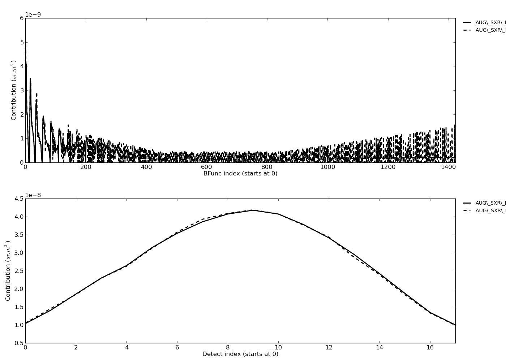
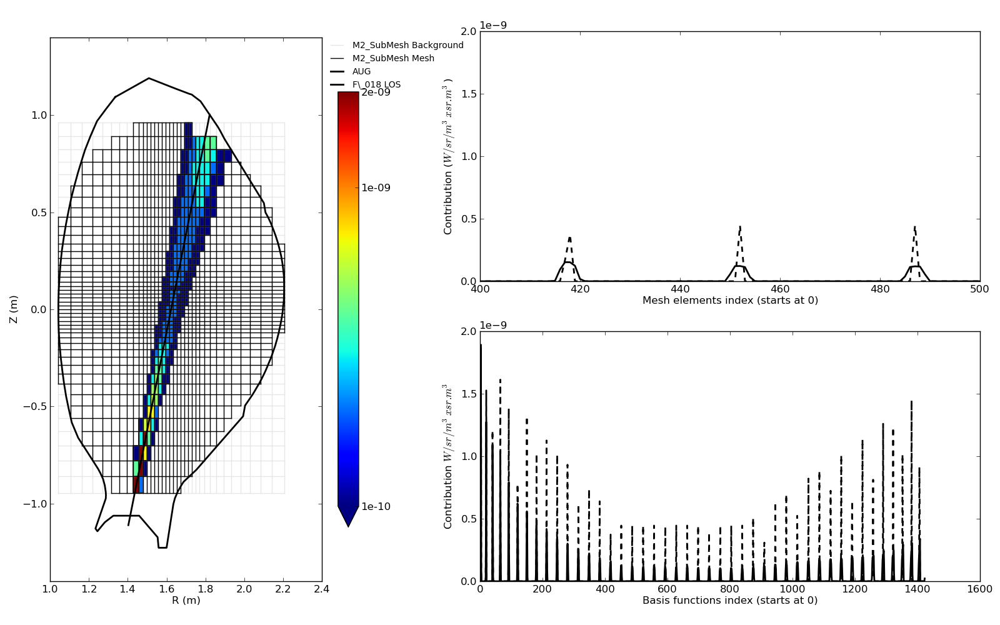
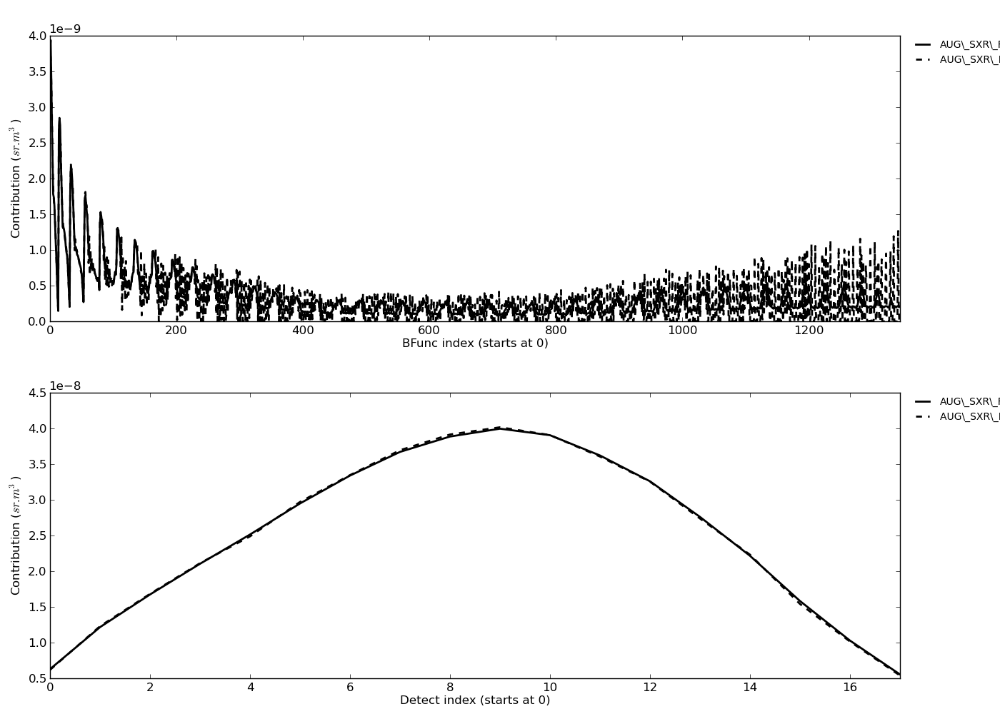
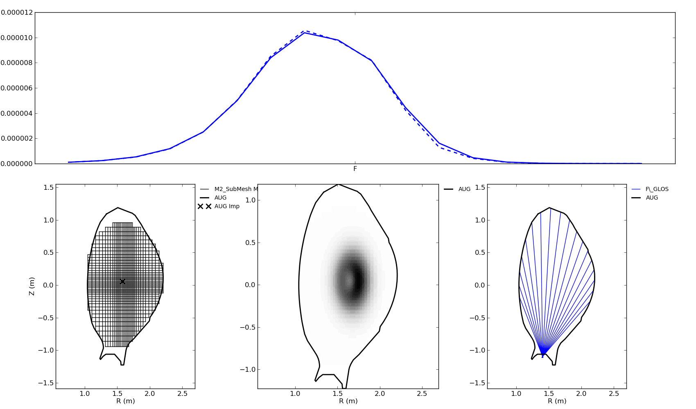
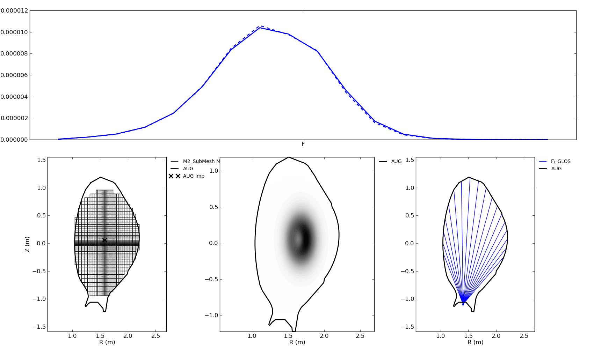

.. role:: envvar(literal)
.. role:: command(literal)
.. role:: file(literal)
.. role:: ref(title-reference)

**ToFu_MatComp**
================

(This project is not finalised yet, work in progress...)

**ToFu_MatComp**, is a ToFu module aimed at computing the geometry matrix associated to a diagnostic geometry from **ToFu_Geom** and a set of basis functions from **ToFu_Mesh**. From the first, it requires either a GDetect object or a GLOS object (keep in mind that a GDetect object automatically includes its associated GLOS object), or more simply a list of Detect objects or LOS objects (in case you don't want to define their group equivalent for any particular reason). From **ToFu_Mesh**, it requires a BaseFunc2D or BaseFunc3D object.  

The outupt (i.e.: the computed geometry matrix) can be retrieved directly as a numpy array, or as a **ToFu_MatComp** object, which includes the array as an attribute and also provides useful methods to quickly explore its main characteristics, as illustrated in the following. 

Hence, **ToFu_MatComp** provides the following object classes : 

.. list-table:: The object classes in **ToFu_Geom**
   :widths: 10 30 20
   :header-rows: 1

   * - Name
     - Description
     - Inputs needed
   * - GMat2D
     - A geometry matrix computed from a BaseFunc2D object (i.e.: a 2D set of basis functions, assuming the toroidal angle is an ignorable coordinate).
     - A GDetect object or a list of Detect objects, and a BaseFunc2D object. 
   * - GMat3D
     - A geometry matrix computed from a BaseFunc3D object (i.e.: a 3D set of basis functions, not implemented yet...).
     - To do...
   

The following will give a more detailed description of each object and its attributes and methods through a tutorial at the end of which you should be able to compute your own geometry matrix and access its main characteristics.

Getting started with ToFu_MatComp
---------------------------------

To use **ToFu_MatComp**, you first need to import it as well as **ToFu_PathFile**. Of course, **matplotlib** and **numpy** will also be useful. 

.. literalinclude:: ../../src/Tutorial_ToFu_MatComp.py
   :language: python
   :lines: 7-15

The os module is used for exploring directories and the cPickle module for saving and loading objects.
We first need to load a BaseFunc2D object (created using **ToFu_Mesh** and saved), as well as a **GDetect** object (created with **ToFu_Geom** and saved):

.. literalinclude:: ../../src/Tutorial_ToFu_MatComp.py
   :language: python
   :lines: 20-23

In the following, we will illustrate the capacities of **ToFu_MatComp** with the F camera of the SXR diagnostic of ASDEX Upgrade and a relatively coarse 2D mesh with resolution around 2 cm near in the central region and around 6 cm near the edge, on which degree 0 bivariate B-splines have been imposed (we will illustrate later the use of 1st and 2nd order bivariate B-splines).

Now we simply need to build the associated geometry matrix. Computation will be done in two steps : first, an index matrix will be computed (a numpy array of boolean) that indicates for each detector which mesh elements it can see (by checking whether they are it is projected viewing cone), this first step typically takes 1-5 min for each detector and helps a lot making the second step faster. The second step consists in proper computing of the integrated contribution of each basis function for each detector. This is obviously longer and typically takes 2-6 min per detector (instead of at least 10 times more without the first step).
Finally, both for comparison purposes and for those users who want to use a pure LOS approach, another geometry matrix is computed with a pure LOS approximation, which is obviously much faster and typically takes 0.01-1 s per detector (as always, it depends on the mesh resolution and basis function degree).

.. literalinclude:: ../../src/Tutorial_ToFu_MatComp.py
   :language: python
   :lines: 26-28

Now that we have a proper GMat2D object, let us use its built-in methods to explore its properties.

First of all, we can plot the total contribution (from all the basis functions) to each detector simply by plotting the sum of the geometry matrix, and comparinmg it to the sum of the LOS-approximated geometry matrix. You can do this manually or use the dedicated built-in method, which also shows the sum in the other dimension (i.e.: the total contribution of each basis function to all detectors):

.. literalinclude:: ../../src/Tutorial_ToFu_MatComp.py
   :language: python
   :lines: 31,33

   
   Total contribution of each basis function (top) and total contribution to each detector (bottom) for a 0th order set of B-splines and the F camera of ASDEX Upgrade, with both LOS and 3D computations

We can see that there seems to be little difference between the full 3D and the LOS approximated matrices, but let us go a little further into the details by visualising the values of the gometry matrix for a particular chosen detector, and compare it to its LOS-approximated equivalent:

.. literalinclude:: ../../src/Tutorial_ToFu_MatComp.py
   :language: python
   :lines: 35-36,38

   
   Total contribution of each 0th order basis function to detector F_016 of ASDEX Upgrade, decomposed on mesh elements (top) and basis functions (bottom), with both LOS and 3D computations

Similarly, we can go the other way around and visualise the values of the geometry matrix for any chosen basis function (and thus see how it contributes to various detectors):

.. literalinclude:: ../../src/Tutorial_ToFu_MatComp.py
   :language: python
   :lines: 40,42
   
.. figure:: figures_doc/Fig_Tutor_ToFuMatComp_GM0_BF.png
   :height: 400px
   :width: 600 px
   :scale: 100 %
   :alt: Total contribution of a particular 0th order basis function to each detector of camera F of ASDEX Upgrade, with both LOS and 3D computations, the chosen pixel is ognored by the LOS approximation, while in reality it is seen by two detectors.
   :align: center
   
   Total contribution of a particular 0th order basis function to each detector of camera F of ASDEX Upgrade, with both LOS and 3D computations, the chosen pixel is ognored by the LOS approximation, while in reality it is seen by two detectors.

We can see significant differences when we consider the details of a specific line (or column) of the geometry matrix, which is important because it provides the set of equations that link the basis functions to the measurements. If you want to perform an inversion, you should pay particular attention to this set of equations as the tomography problem hinges on Fredholm integral equations of the first kind, making it an ill-posed problem particularly sensitive to errors both in the measurements and in the equations.

In summary, Despite similar sum (i.e. total contribution to each detector), we observe that with the LOS approximation the number of pixels that contribute to the signal is smaller but that their contribution is generally over-estimated as compared to the full 3D computation. If we consider each line of the geometry matrix, this line represents the equation associated to a particular detector measurement f_i:

.. math::
   f_i = M_{i,1}b_1 + M_{i,2}b_2 + ... + M_{i,N}b_N

Our observation then means that both computations give the same sum of terms on the right hand side, but that the LOS approximation tends to give higher values but for a fewer number of terms, thus affecting the spread of the weights on the different terms. This is an important limitation of the LOS approximation when it used to compute a geometry matrix using pixels as basis functions.

Now let us consider the same matrix but computed with 1st and 2nd order bivariate B-splines:

.. literalinclude:: ../../src/Tutorial_ToFu_MatComp.py
   :language: python
   :lines: 46,50-51,55,57

   
   Total contribution of each basis function (top) and total contribution to each detector (bottom) for a 1st order set of B-splines and the F camera of ASDEX Upgrade, with both LOS and 3D computations

.. figure:: figures_doc/Fig_Tutor_ToFuMatComp_GM1_Detect.png
   :height: 400px
   :width: 600 px
   :scale: 100 %
   :alt: Total contribution of each 1st order basis function to detector F_016 of ASDEX Upgrade, decomposed on mesh elements (top) and basis functions (bottom), with both LOS and 3D computations
   :align: center
   
   Total contribution of each 1st order basis function to detector F_016 of ASDEX Upgrade, decomposed on mesh elements (top) and basis functions (bottom), with both LOS and 3D computations

.. figure:: figures_doc/Fig_Tutor_ToFuMatComp_GM1_BF.png
   :height: 400px
   :width: 600 px
   :scale: 100 %
   :alt: Total contribution of a particular 1st order basis function to each detector of camera F of ASDEX Upgrade, with both LOS and 3D computations, the chosen pixel is ognored by the LOS approximation, while in reality it is seen by two detectors.
   :align: center
   
   Total contribution of a particular 1st order basis function to each detector of camera F of ASDEX Upgrade, with both LOS and 3D computations, the chosen pixel is ignored by the LOS approximation, while in reality it is seen by two detectors.

.. literalinclude:: ../../src/Tutorial_ToFu_MatComp.py
   :language: python
   :lines: 59,63-64,68,70

   
   Total contribution of each basis function (top) and total contribution to each detector (bottom) for a 2nd order set of B-splines and the F camera of ASDEX Upgrade, with both LOS and 3D computations

.. figure:: figures_doc/Fig_Tutor_ToFuMatComp_GM1_Detect.png
   :height: 400px
   :width: 600 px
   :scale: 100 %
   :alt: Total contribution of each 2nd order basis function to detector F_016 of ASDEX Upgrade, decomposed on mesh elements (top) and basis functions (bottom), with both LOS and 3D computations
   :align: center
   
   Total contribution of each 2nd order basis function to detector F_016 of ASDEX Upgrade, decomposed on mesh elements (top) and basis functions (bottom), with both LOS and 3D computations

.. figure:: figures_doc/Fig_Tutor_ToFuMatComp_GM1_BF.png
   :height: 400px
   :width: 600 px
   :scale: 100 %
   :alt: Total contribution of a particular 2nd order basis function to each detector of camera F of ASDEX Upgrade, with both LOS and 3D computations, the chosen pixel is ognored by the LOS approximation, while in reality it is seen by two detectors.
   :align: center
   
   Total contribution of a particular 2nd order basis function to each detector of camera F of ASDEX Upgrade, with both LOS and 3D computations, the chosen pixel is ignored by the LOS approximation, while in reality it is seen by two detectors.

We see that the overlapping of higher-order basis functions ensures a more balanced distribution of the weights computed with a LOS approximation. This, and the fact that the basis functions are more regular, makes higher order basis functions a valuable improvement for tomographic inversions using a geometry matrix computed with a LOS approximatiopn. Obviously a full 3D computation remains even more accurate.

Now that the geometry is computed (with whatever method or basis functions), it can be used as in two ways : either as the set of equation necessary for solving the tomographic inversions (see **ToFu_Inv**), or as a pre-computed intermediate for forward-modelling or synthetic diagnostic (i.e.: reconstructing the measurements assuming an input emissivity field). This method only requires that the chosen basis functions are relevant for the input emissivity (i.e.: don't use a GMat2D object if the emissivity is not toroidally constant, or if the emissivity is anisotropic). Once you are sure that you have a relevant set of basis functions with their associated geometry matrix, just fit the basis functions to the input emissivity (this will give you the coefficients of each basis function) and use the geometry matrix to get the associated measurements, as illustrated below:

.. literalinclude:: ../../src/Tutorial_ToFu_MatComp.py
   :language: python
   :lines: 74-87,89,91,93

   
   Synthetic diagnostic using decomposition of an input emissivity on a set of 0th order B-splines, geometry matrix computed with both 3D and LOS approach

.. figure:: figures_doc/Fig_Tutor_ToFuMatComp_GM1_Sig.png
   :height: 400px
   :width: 600 px
   :scale: 100 %
   :alt: Synthetic diagnostic using decomposition of an input emissivity on a set of 1st order B-splines, geometry matrix computed with both 3D and LOS approach
   :align: center
   
   Synthetic diagnostic using decomposition of an input emissivity on a set of 1st order B-splines, geometry matrix computed with both 3D and LOS approach

   
   Synthetic diagnostic using decomposition of an input emissivity on a set of 2nd order B-splines, geometry matrix computed with both 3D and LOS approach

This method is faster than the direct, brute-force computation introduced in **ToFu_Geom**, but is limited by the relevance of the basis functions with respect to the input emissivity.
We can see that the LOS approximation generally gives better results (in a synthetic diagnostic approach) when used with higher-order basis functions (as explained earlier). The difference is visible between 0th and 1st order basis functions (but not so much between 1st and 2nd order basis functions).

Furthermore, another general tendency appears : the LOS approximation tends to underestimate the signal for the lines on the High Field Side (HFS) and to overestimate it for the LOS on the Low Field Side (LFS), with respect to the region of maximum emissivity. This is consistent with the fact that the toroidicity induces a general shift towards the LFS. Hence the geometrically optimal LOS (from the center of mass of the detector to the center of mass of the intersection of of all its appertures) is optimal in cartesian coordinates but not in cylindrical coordinates. A different LOS (chosen taking into account the toroidicity, for example by computing the center of mass the viewing cone in (R,theta) coordinates) would probably help solve this issues and would allow you to use a pure LOS approximation with better validity (to do in ToFu_Geom...). 

Again, the above numerical results are just helpful to understand what's going on, but keep in mind that the degree of accuracy of the LOS approximation not only depends on the geometry, but also on the input emissivity that you are using (i.e.: large gradients / curvature, toroidal changes, anistropy, localised particular features...).

Limits to the LOS approximation for the geometry matrix computation
-------------------------------------------------------------------

As we saw, the fact that the final solution is probably compatible with the LOS approximation (i.e. it has 'reasonable' curvature across most viewing cones) does not mean that the LOS approximation is valid with the basis functions used to compute it. Indeed, the LOS approximation can basically be written as follows:

.. math::
   f_i = \int_{LOS}\iint_S\int_{4\pi}\epsilon^{\eta}\delta_id^2\Omega d^2Sdl = E_i\int_{LOS}\left<\epsilon^{\eta}\right>dl\\

Where E_i is the etendue of detector i and: 

.. math::
  \begin{array}{l}
    \left<\epsilon^{\eta}\right> = \frac{1}{E_i} \iint_S\int_{4\pi}\epsilon^{\eta}\delta_id^2\Omega d^2S\\
    E_i = \iint_S\int_{4\pi}\delta_id^2\Omega d^2S
  \end{array}

The corresponding LOS-approximated signal would be:

.. math::
   \hat{f_i} = E_i\int_{LOS}\epsilon^{\eta}dl

Hence, the LOS approximation is valid if we can safely assume that the local value of the emissivity on the LOS is a approximation of its value averaged on the surface perpendicular to the LOS:

.. math::
   \hat{f_i} \approx f_i \Leftrightarrow \int_{LOS}\left<\epsilon^{\eta}\right>dl \approx \int_{LOS}\epsilon^{\eta}dl

Which can be fulfilled if (but not exclusively if):

.. math::
   \forall \  l \  \in \  LOS \ , \   \epsilon^{\eta}\left(l\right) \approx \frac{1}{E_i} \iint_S\int_{4\pi}\epsilon^{\eta}\delta_id^2\Omega d^2S\left(l\right)  =  \left<\epsilon^{\eta}\right>\left(l\right)

When applied to a physical (i.e. real) emissivity field, this assumption may hold because the emissivity field usually considered varies sufficiently slowly in the direction perpendicular to the LOS (in the limits of the viewing cone). However, when computing the geometry matrix, this equation is not applied to a 'physiscal' emissivity field, but to individual basis functions. In particular, if the nature of these basis functions allows for steep variations across the LOS and in the limits of the viewing cone, then the LOS approximation may need to be questionned.

A typical case is pixels (i.e.: 0th order bivariate B-splines), particularly when they have a size too small compared to the local beam width (ref : my thesis + ingesson). In such cases, the above integral, taken for a single pixel (which is what is evaluated in the geometry matrix) can in no way be approximated by the value in the pixel (i.e.: on the LOS). 

This is a very common mistake : even if the LOS approximation is valid for the final solution, it does not mean it is valid for the basis functions that you are using ! And, ironicaly, using it for computing the geometry matrix anyway will lead to a final solution that will be less regular than it should be because the LOS approximation tends to overestimate the contribution of some pixels and underestimate the contribution of others. Paradoxically, not using the LOS approximation for the geometry matrix is both more physical and leads to solutions which are more likely to be compatible with this LOS approximation ! Again, this depends on the basis functions you are using (nature and size).

If you still want to use pixels and the (pure) LOS approximation together, a rule of thumb to limit the bias is to use pixels of a size comparable to the beam width in the region where the signal is maximal (but there will still be situations in which the approximation will not hold, see : my thesis). Another quite common solution is to make your own 'homemade' routine to compensate for the beam width (for example with anti-aliasing, with adaptative LOS or with hybrid 1D-2D-3D solutions). Most people have their own tricks to compensate in a way or another.

Other solutions are either to use the LOS approximation but with different basis functions such as 1st or 2nd order bivariate B-splines (both because their support overlap and because they are more regular), or 'simply' not to use the LOS approximation (but an accurate full 3D computation requires a lot of painful work). Since both these solutions are fully implemented in **ToFu**, you can start rejoicing and using it :-)

.. Local Variables:
.. mode: rst
.. End:
