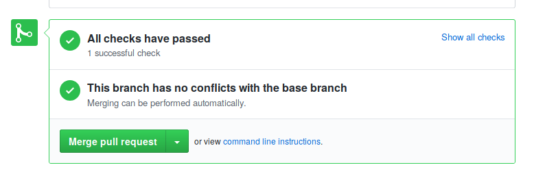
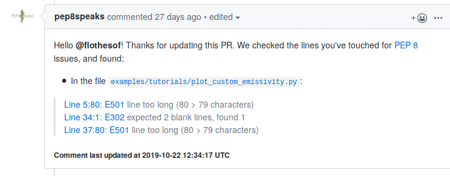

Contribute to tofu
==================

You found a bug, or you want to add something to the library? This
tutorial will show you how to get the repository and the first steps to
contribute to the project.

Bug reports and suggestions
----------------------------

If you found a bug in **tofu**, or if you have a suggestion, the best is to open
an issue directly on our `github page <https://github.com/ToFuProject/tofu/issues>`_.
If you are opening an issue related to a bug found, please specify the version
of the librairies (**tofu**, python, etc.) you are using, any configuration
information that might be helpful to us (OS, server, how you installed
**tofu**), a minimal example to recreate the bug (if possible), and the log
files or errors you might have got.

Developping in the code
-----------------------

The basic tools
"""""""""""""""

There are many tools and concepts to get familiar with when contributing
to an **open-source python library**. A good place to get started is the
`scikit-project <https://github.com/nathanshammah/scikit-project>`__.
And here is a list of tools you should get familiar with:

-  ``Python``: the main language of **tofu**
-  ``IPython``: powerful interactive shell for python, and check this
   `tutorial <https://ipython.org/ipython-doc/3/interactive/tutorial.html>`__
-  ``git``, and the `feature branch
   workflow <https://www.atlassian.com/git/tutorials/comparing-workflows/feature-branch-workflow>`__
-  ``github``: follow and watch `our
   project <https://github.com/ToFuProject/tofu>`__
-  A text editor: ``emacs``, ``vim``, ``sublime``, or whichever you want

We will use Miniconda (light version of Anaconda, but you can also work
with Anaconda or another python package manager of your choice) not only
to install and manage the packages necessary for installing ToFu, but
also to have a working bash-like Terminal.

-  `Get the latest version and install
   it. <https://docs.conda.io/en/latest/miniconda.html>`__
-  Follow the directions (you can use default options)

We are going to create an environment specific for ToFu.

::

   $ conda create -n tofu3 python scipy numpy cython git ipython
   $ conda activate tofu3

This creates a conda environment named "tofu3" and installs scipy,
numpy, git, ipython and cython. The second command activates this
environment.

-  Create a ssh public key and add it to your GitHub account: `follow
   this
   tutorial. <https://help.github.com/en/articles/adding-a-new-ssh-key-to-your-github-account>`__
-  Go to ToFu's GitHub repository:
   `here. <https://github.com/ToFuProject/tofu/>`__
-  Click on "clone or download" and swith to the option "Use SSH". Copy
   the link.
-  Move to where you would like to install ToFu ``$ cd some_path``
-  ``$ git clone git@github.com:ToFuProject/tofu.git`` (make sure you
   remember the path where you are installing, if you want to install it
   into your home repository, just make sure to ``cd ~`` before the
   ``git clone...``)

-  Move to the tofu directory, probably: ``cd ~/tofu``
-  Switch to the ``git`` branch you will be working on. If you are just
   starting you probably want to start from the latest develop branch:
   ``git checkout devel``. If you are not familiar with **git** take a
   look at `this tutorial
   (long) <https://www.atlassian.com/git/tutorials>`__ or `this short
   one <https://rogerdudler.github.io/git-guide/>`__
-  Compile ``python setup.py build_ext --inplace``
-  Make sure tests are running ``pytest tofu/tests``

Where to start?
"""""""""""""""

If you wish to contribute, but don't know where to start, check `our
open issues <https://github.com/ToFuProject/tofu/issues>`__. You can
also read `this
tutorial <https://github.com/firstcontributions/first-contributions>`__,
on how to contribute to a github project.

Git branches and pull requests
""""""""""""""""""""""""""""""

Before modifying the code, you
should create a new branch (based on the *devel* branch) and switch to it.

::

   git checkout -b <theNameOfYourBranch> # probably IssueNumber eg. Issue123
   # change the source code
   git add <files you changed>
   git commit -m "[a tag] a message that explains what you changed"
   git push -u origin <theNameOfYourBranch>

Now you can open a pull request in our `github
page <https://github.com/ToFuProject/tofu/pulls>`__, from your branch,
``theNameOfYourBranch`` to ``devel``. We will review it, comment it, and
accept it.

Continuous integration
""""""""""""""""""""""

For each pull request (PR) on github, there will be a series of tests run to
make sure the modifications introduced to the library did not introduce any
errors. If all tests pass, you should see something like the image below.

If there is an error (red cross instead of green check) it can be either that
your code is breaking the normal functionning of the code, or (less probably)
that there is a bug in the unit tests. Please try and understand what went wrong.
If you cannot find the problem, you can ask for help by commenting on the PR.
Additionally to the unit tests, we have integrated pep8speaks_, a bot that will
check your coding style.

.. _pep8speaks: https://pep8speaks.com/

